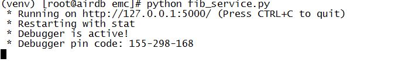
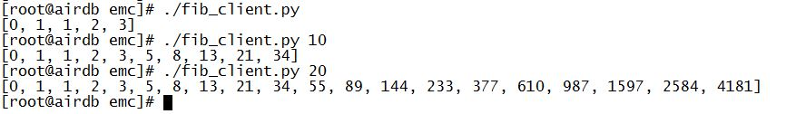
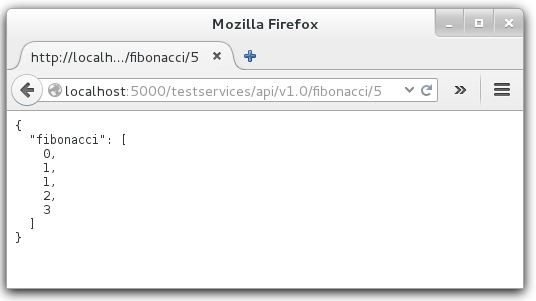

## Install and Run

1. Use the build_dev_env.sh to build your private python and Flask Env.
2. copy the fib_service.py into your private Env.
3. start the service with the follow command:

	python fib_service.py

4. you will see the output like this:

5. open another terminal, and use the fib_client.py to test the service:

6. you can also use browser to test the Fibonacci service

##There are also unittest cases in the test directory.

